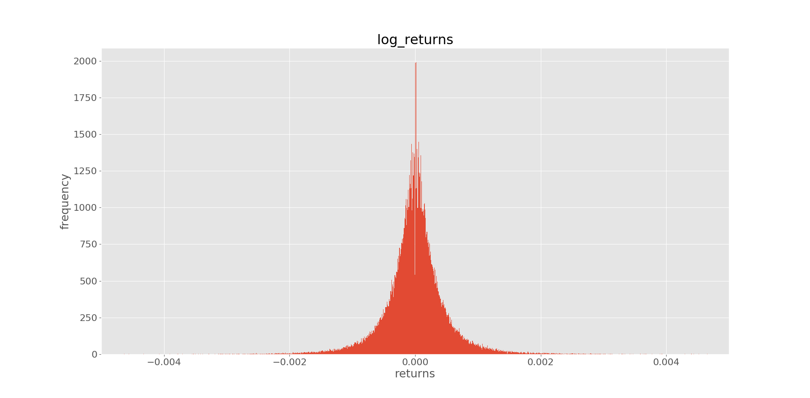
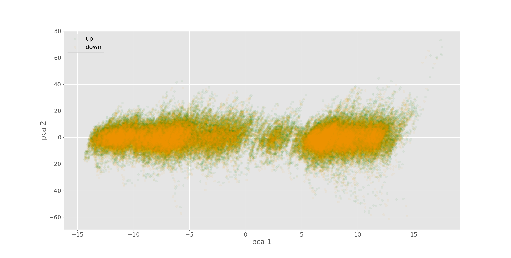

# **EUR/USD Foreign Exchange Rate Prediction**

Used classification machine learning models like logistic regression, boosted trees, and neural networks to predict the future direction of of the EUR/USD foreign exchange rates with technical analysis.

#### Table of Contents
1. [Data Flow Diagram](#data-flow-diagram)
2. [Historical Data](#historical-data)
3. [Target](#target)
4. [Features](#features)
5. [Modeling](#modeling)
6. [Results](#results)
7. [Paper Trading](#paper-trading)
8. [Web Application](#web-application)
9. [Tech Stack](#tech-stack)
10. [Resources](#resources)

# Data Flow Diagram

# Historical Data

The Oanda API was used to download historical EUR/USD candles to a PostgreSQL database. A candle is the open, high, low, and close price over a time period.  Mid prices (between bid / ask prices) were used. The API only allows you to receive 5,000 records per request so I setup a script to download this information overnight. The database contains separate tables with the OHLC and Volume every 5 seconds, 10 seconds, 15 seconds, etc. from 2005 to today.

Granularity | Description
--- | ---
S5 | 5 second candlesticks, minute alignment
S10 | 10 second candlesticks, minute alignment
S15 | 15 second candlesticks, minute alignment
S30 | 30 second candlesticks, minute alignment
M1 | 1 minute candlesticks, minute alignment
M2 | 2 minute candlesticks, hour alignment
M4 | 4 minute candlesticks, hour alignment
M5 | 5 minute candlesticks, hour alignment
M10 | 10 minute candlesticks, hour alignment
M15 | 15 minute candlesticks, hour alignment
... |

#### Candle Stick

https://en.wikipedia.org/wiki/Candlestick_chart

#### 15 Minute Candles Example
| time | volume | open | high | low | close | complete |
|---------|--------|----------|----------|----------|----------|----------|
| 6:45:00 | 473 | 1.346250 | 1.348050 | 1.345950 | 1.348050 | True |
| 7:00:00 | 481 | 1.347950 | 1.348250 | 1.347350 | 1.348150 | True |
| 7:15:00 | 303 | 1.348150 | 1.348350 | 1.347300 | 1.347900 | True |
| 7:30:00 | 290 | 1.348000 | 1.350850 | 1.348000 | 1.350750 | True |
| 7:45:00 | 373 | 1.350650 | 1.353250 | 1.350250 | 1.352800 | True |
| 8:00:00 | 290 | 1.352800 | 1.354700 | 1.352500 | 1.352500 | True |
| 8:15:00 | 219 | 1.352400 | 1.353000 | 1.351250 | 1.351570 | True |
| 8:30:00 | 206 | 1.351670 | 1.351900 | 1.350470 | 1.351700 | True |
| 8:45:00 | 186 | 1.351750 | 1.353270 | 1.351750 | 1.353070 | True |
| 9:00:00 | 462 | 1.352970 | 1.353070 | 1.351420 | 1.352820 | True |

#### EUR/USD 1 Month Candles with Volume from 2005 to Today

http://developer.oanda.com/rest-live-v20/introduction/

https://www.tradingview.com/

*Future Opportunities: Incorporate more data, economic calendar, historical position ratios, bid ask spreads, commitments of traders, order book, tick data, etc.*

# Target

I am using a binary classification target (1 / 0) of whether or not the close price of the next candle is higher or lower than the close price of the current candle. I also calculated the log returns which are used for calculating total returns at the end.

| time | volume | open | high | low | close | log_returns | log_returns_shifted | target |
|----------|--------|----------|----------|----------|----------|-------------|---------------------|--------|
| 18:15:00 | 1 | 1.356000 | 1.356000 | 1.356000 | 1.356000 | nan | 0.000000 | 1 |
| 18:30:00 | 1 | 1.356000 | 1.356000 | 1.356000 | 1.356000 | 0.000000 | 0.000516 | 1 |
| 18:45:00 | 4 | 1.356700 | 1.356800 | 1.356500 | 1.356700 | 0.000516 | 0.000147 | 1 |
| 19:00:00 | 5 | 1.356900 | 1.357000 | 1.356900 | 1.356900 | 0.000147 | -0.000959 | 0 |
| 19:15:00 | 27 | 1.356500 | 1.356900 | 1.355600 | 1.355600 | -0.000959 | 0.000221 | 1 |
| 19:30:00 | 6 | 1.355600 | 1.356500 | 1.355600 | 1.355900 | 0.000221 | -0.000074 | 0 |
| 19:45:00 | 6 | 1.356000 | 1.356000 | 1.355800 | 1.355800 | -0.000074 | 0.000000 | 1 |
| 20:00:00 | 12 | 1.355900 | 1.356100 | 1.355800 | 1.355800 | 0.000000 | 0.000000 | 1 |
| 20:15:00 | 15 | 1.355700 | 1.355900 | 1.355600 | 1.355800 | 0.000000 | 0.000148 | 1 |
| 20:30:00 | 27 | 1.355900 | 1.356000 | 1.355800 | 1.356000 | 0.000148 | -0.001033 | 0 |

#### Log Returns Distribution

*Future Opportunities: Incorporate regression not just classification.*

# Features

Technical Analysis Indicators were used as features for this analysis. A range of parameters were used for each indicator and the dimensionality was later reduced by feature importance calculations, PCA, or regularization within the models.

#### Sample of Technical Indicators without Parameters

| Group | Short Name | Name | Parameters | Output |
|-----------------------|--------------|---------------------------------------------|------------|-----------------------|
| Momentum Indicators | BOP | Balance Of Power | [] | [real] |
| Overlap Studies | HT_TRENDLINE | Hilbert Transform - Instantaneous Trendline | [] | [real] |
| Volume Indicators | AD | Chaikin A/D Line | [] | [real] |
| Cycle Indicators | HT_SINE | Hilbert Transform - SineWave | [] | [sine, leadsine] |
| Cycle Indicators | HT_TRENDMODE | Hilbert Transform - Trend vs Cycle Mode | [] | [integer] |
| Volatility Indicators | TRANGE | True Range | [] | [real] |

#### Sample of Technical Indicators with Only Timeperiod Parameter

I used each technical indicator with timeperiod 5, 15, 25, 35, and 45.

| Group | Short Name | Name | Parameters | Output |
|-----------------------|---------------------|---------------------------------------------------|------------------|----------------------|
| Momentum Indicators | AROON | Aroon | [timeperiod: 14] | [aroondown, aroonup] |
| Momentum Indicators | MOM | Momentum | [timeperiod: 10] | [real] |
| Momentum Indicators | RSI | Relative Strength Index | [timeperiod: 50] | [real] |
| Momentum Indicators | WILLR | Williams' %R | [timeperiod: 14] | [real] |
| Overlap Studies | DEMA | Double Exponential Moving Average | [timeperiod: 30] | [real] |
| Overlap Studies | EMA | Exponential Moving Average | [timeperiod: 30] | [real] |
| Overlap Studies | SMA | Simple Moving Average | [timeperiod: 30] | [real] |
| Volatility Indicators | ATR | Average True Range | [timeperiod: 14] | [real] |
| Volatility Indicators | NATR | Normalized Average True Range | [timeperiod: 14] | [real] |
| Statistic Functions | BETA | Beta | [timeperiod: 5] | [real] |
| Statistic Functions | LINEARREG_ANGLE | Linear Regression Angle | [timeperiod: 14] | [real] |

#### Sample of Technical Indicators with More Than 1 Parameter

| Group | Short Name | Name | Parameters | Output |
|---------------------|------------|-------------------------------------------------|--------------------------------------------------------------------------------------------------------------------------------------------------------------------------------------------------------------------|------------------------------------------|
| Momentum Indicators | MACD | Moving Average Convergence/Divergence | ['fastperiod: 12', 'slowperiod: 26', 'signalperiod: 9'] | ['macd', 'macdsignal', 'macdhist'] |
| Momentum Indicators | STOCH | Stochastic | ['fastk_period: 5', 'slowk_period: 3', 'slowk_matype: 0', 'slowd_period: 3', 'slowd_matype: 0'] | ['slowk', 'slowd'] |
| Overlap Studies | BBANDS | Bollinger Bands | ['timeperiod: 5', 'nbdevup: 2', 'nbdevdn: 2', 'matype: 0'] | ['upperband', 'middleband', 'lowerband'] |
| Overlap Studies | MAMA | MESA Adaptive Moving Average | ['fastlimit: 0.5', 'slowlimit: 0.05'] | ['mama', 'fama'] |
| Volume Indicators | ADOSC | Chaikin A/D Oscillator | ['fastperiod: 3', 'slowperiod: 10'] | ['real'] |
| Statistic Functions | STDDEV | Standard Deviation | ['timeperiod: 5', 'nbdev: 1'] | ['real'] |
| Statistic Functions | VAR | Variance | ['timeperiod: 5', 'nbdev: 1'] | ['real'] |

https://mrjbq7.github.io/ta-lib/funcs.html

*Future Opportunities: More technical indicators with varying parameters.*

# Feature Analysis

Feature importance was calculated of the technical indicators with a variety of methods including Chi Squared Test, ANOVA F-value test, Mutual Information test, Logistic Regression with Regularization, and Tree Based Gini Information Gain feature importance.

#### Chi Squared Calculation for Feature Selection

| Indicator | Chi 2 Feature Importance |
|--------------------|--------------------------|
| STOCHRSI_FASTK | 187 |
| WILLR_5_REAL | 1490 |
| STOCHF_FASTK | 149 |
| WILLR_15_REAL | 118 |
| BOP_REAL | 97 |

#### ANOVA F-value Calculation for Feature Importance

| Indicator | ANOVA Feature Importance |
|-----------------|--------------------------|
| STOCHF_FASTK | 9074 |
| WILLR_5_REAL | 907 |
| RSI_5_REAL | 892 |
| CMO_5_REAL | 892 |
| WILLR_15_REAL | 742 |

#### Mutual Information Calculation for Feature Importance

| Indicator | Mutual Info Feature Importance |
|------------------------|--------------------------------|
| STOCHF_FASTK | 0.006 |
| STOCHRSI_FASTK | 0.005 |
| RSI_5_REAL | 0.005 |
| CMO_5_REAL | 0.005 |
| AROON_15_AROONUP | 0.004 |

#### Explained Variance of Features

#### PCA the Features to 2 Dimensions to Observe Separability

Also tried dimensionality reduction  with t-sne but the calculation was expensive.

# Modeling

Data transformation and modeling pipelines were used to gridsearch and cross validate the models and prevent data leakage. The data transformation steps include scaling, selecting the best features, and dimensionality reduction. Logistic regression, boosted trees, and neural networks were used for the models. Each step in the pipeline has a variety of parameters that can be tuned and each time granularity uses its most important features and feature timeframes. I used a powerful Amazon Web Service EC2 server to compute the gridsearch parameter optimization in parallel. Both ROC AUC and a Custom % Return function were used for gridsearching scoring.

*Future Opportunities: Optimize the gridsearch scoring function to incorporate other financial metrics including alpha, beta, max drawdown, etc.*

# Results

Scaling the Features, PCA down to 100 dimensions, and the Logistic Regression with Regularization model provided the best ROC area under the curve and the highest returns. The Multilayer Perceptron Model was a close second.

#### ROC Curve with Logistic Regression all Candles

#### ROC Curve with 15 Minute Candles

#### Returns with 15 Minute Candles

*Future Opportunities: Stack classification and regression models. Tune a trading strategy based upon probabilities. Use a backtesting library (zipline) incorporating bid / ask spreads, trading fees.*

# Paper Trading

Currently the Logistic Regression model is being Paper Traded (Fake Money with a Demo Account) with the 15 Minute Candle Model. The script is running on a free AWS EC2 instance with a PostgreSQL database to store the historical candles. We'll see how it does...

# Web Application

The web app has a script that continuously updates the SQL database with new candles for each granularity. Gridsearched Logistic Regression models are used to predict the future direction for each candle granularity then the predictions and best features are displayed in a table.

# Tech Stack

# Resources

* get data
  * oanda restful api
    * eur_usd candles
      * bid / ask / mid
      * open / high / low / close
      * timestamp is at the open
    * https://www.udemy.com/python-algo-trading-fx-trading-with-oanda/
    * http://oanda-api-v20.readthedocs.io/en/latest/index.html
    * http://developer.oanda.com/rest-live-v20/introduction/
  * pickled dataframes
  * postgres
  * mongo
* target
  * sign of (next candle open price - current candle open price)
  * future open price
  * http://www.dcfnerds.com/94/arithmetic-vs-logarithmic-rates-of-return/
* features
  * exponential smoothing
  * log returns
  * technical indicators
    * TA-Lib https://github.com/mrjbq7/ta-lib
    * http://www.ta-lib.org/hdr_dw.html
    * https://mrjbq7.github.io/ta-lib/index.html
    * https://github.com/mobone/ta-machine/blob/master/indicators/sqz.py
    * wget http://prdownloads.sourceforge.net/ta-lib/ta-lib-0.4.0-src.tar.gz
    * tar xvzf ta-lib-0.4.0-src.tar.gz
    * ./configure --prefix=/usr
    * make
    * sudo make install
* models
  * classification vs. regression?
  * classic momentum and such
    * https://www.oreilly.com/learning/algorithmic-trading-in-less-than-100-lines-of-python-code
    * https://www.datacamp.com/community/tutorials/finance-python-trading#gs.DSdj=ds
  * machine learning
    * https://arxiv.org/pdf/1605.00003.pdf
    * http://wseas.us/e-library/conferences/2011/Penang/ACRE/ACRE-05.pdf
    * http://francescopochetti.com/stock-market-prediction-part-introduction/
  * neural nets (rnn / lstm)
    * https://github.com/GalvanizeOpenSource/Recurrent_Neural_Net_Meetup
    * http://www.jakob-aungiers.com/articles/a/LSTM-Neural-Network-for-Time-Series-Prediction
    * http://www.jakob-aungiers.com/articles/a/Multidimensional-LSTM-Networks-to-Predict-Bitcoin-Price
    * https://machinelearningmastery.com/time-series-forecasting-long-short-term-memory-network-python/
    * https://www.otexts.org/fpp
  * probablistic programming
    * https://www.youtube.com/watch?v=coEVZNg_nlA
  * ARIMA
* predict and evaluate performance
  * backtest
    * https://github.com/quantopian/zipline
    * http://gbeced.github.io/pyalgotrade/
    * https://github.com/mementum/backtrader
  * returns, alpha, beta, sharpe, sortino, max drawdown, volatility
  * precision, recall, accuracy
  * mean squared error, root mean squared error
* other references
  * https://github.com/owocki/pytrader
